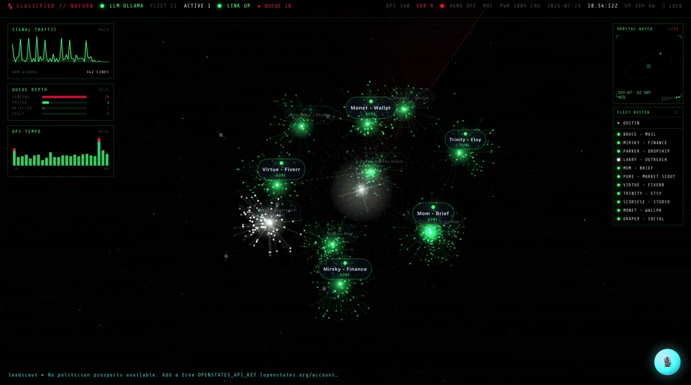
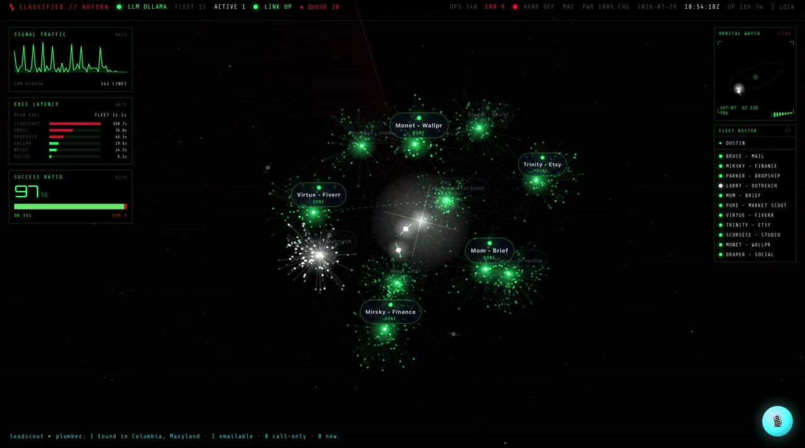

# Autonomous OS

A self-hosted framework for running autonomous agents unattended, with a human
approval gate standing between every agent and every outbound action.

This is the orchestration core: scheduling, persistence, live streaming,
prompt-injection guardrails, a single egress queue, and session auth. It ships
with three example agents that demonstrate the contract. The agents I actually
run on it are not part of this repository.

**[Try the live demo](https://ethan-goldstein.github.io/Autonomous-OS/)** &nbsp;·&nbsp;
read-only, seeded data, no backend.



> **What is not here.** No credentials, no database, no harvested data, no
> private workflows. Every secret is read from the environment; there are no
> hardcoded keys, tokens, or addresses anywhere in this codebase. See
> [SECURITY.md](SECURITY.md).

---

## Why it exists

Most agent projects are a prompt in a loop. The interesting engineering is
everywhere else: what happens when the model is wrong, when the machine sleeps
through a scheduled run, when a provider rate-limits you, when an agent decides
to do something it should not. This codebase is mostly that.

---

## The contract

An agent is one file. Extend the base class, implement `execute()`, return
something JSON-serializable:

```js
export class MyAgent extends Agent {
  constructor() {
    super({ id: 'mine', name: 'My Agent', schedule: '0 */4 * * *' });
  }
  async execute() {
    this.log('Working.');
    return { done: true };
  }
}
```

Register it in `server/registry.js` and it inherits, for free:

- cron scheduling plus sleep-proof catch-up
- SQLite persistence of every run and every log line
- live status and log streaming to the dashboard over SSE
- error capture and overlap guarding
- access to the guarded model dispatcher
- the approval queue for anything outward-facing

Three examples ship in `server/agents/`: a scheduled agent, an event-chained
agent with no cron of its own, and one that demonstrates the approval queue.

---

## Architecture

**Two-tier model dispatcher** (`server/lib/llm.js`). A headless CLI provider is
primary, a local Ollama model is the always-on fallback. Any timeout, rate
limit, or missing binary trips a 10-minute persisted circuit breaker and
reroutes transparently. Inference is capped at 2 concurrent processes behind a
FIFO semaphore, added after unbounded process forking repeatedly took down an
8 GB machine.

**Persistence** (`server/db.js`). Node's built-in `node:sqlite`. No ORM, no
native build step, nothing to migrate. WAL journaling and a 5-second busy
timeout were both added after concurrent writes from overlapping runs started
failing at boot.

**Realtime** (`server/sse.js`). A hand-rolled Server-Sent Events hub with
25-second heartbeat frames to defeat proxy timeouts, plus a REST poll as a
backstop, so the dashboard renders state as it happens rather than on refresh.

**Sleep-proof scheduling** (`server/registry.js`). `node-cron` only fires if the
process is awake at that exact minute; a laptop asleep at 07:00 silently never
runs the 07:00 job. Every 10 minutes a sweep re-parses each agent's cron
expression and replays what was missed, with a 45-minute slack window so
recovery never races the live slot and an errored run never triggers a retry
storm.



**Frontend.** React and TypeScript on Vite. Three runtime dependencies. The
chart and the 3D fleet view are hand-rolled, no chart library. Installable PWA
whose service worker deliberately never caches authenticated routes.

---

## Trust and safety

This is the part worth reading.

**Guardrails at a single chokepoint** (`server/lib/guardrails.js`). Every model
call on every provider is wrapped with the same system prompt: fetched content
is data and never instructions, credentials are never echoed, outward-facing
actions default to drafts. No agent can bypass it because there is only one code
path to the model.

**One egress queue** (`server/lib/approvals.js`). Agents cannot act on the
outside world. They call `requestAction()`, which either auto-executes a `safe`
lane the operator explicitly toggled on, or parks the action for one human tap.

The invariant: **a risky lane can never be auto-approved.** There is no setting
for it, and adding one would not help. `laneAutoOn()` returns false for risky
lanes before it reads any toggle. The policy engine imports no integrations at
all; handlers are injected at registration, so the rule cannot be routed around.

**Auth mounted before any route is declared** (`server/lib/auth.js`). Stateless
HMAC-SHA256 signed cookies on `node:crypto` alone, constant-time comparison, and
an allowlist-by-prefix gate installed ahead of every handler, so a newly added
endpoint physically cannot ship unauthenticated by omission.

**No localhost bypass, deliberately.** TLS terminates on the same host and
proxies to loopback, so exempting `127.0.0.1` would silently disable
authentication for every device on the private network. Documented in-line as a
standing invariant.

---

## Running it

```bash
cp .env.example .env
npm install
npm run dev
```

Binds to `127.0.0.1` by default. Exposing it is left to you; a private mesh
network with no port forwarding is the intended shape.

**Not included:** the MediaPipe WASM bundle used by optional webcam gesture
control (fetch it from `@mediapipe/tasks-vision`, already a dependency).

---

## About

I am Ethan Goldstein, a Computer Information Systems student at the University
of South Carolina working on AI systems and workflow automation.

I run a private fleet on this framework. Most of what is interesting in it came
from something breaking: the concurrency semaphore exists because unbounded
process forking took down an 8 GB machine, the WAL journaling exists because
concurrent writes were failing at boot, and the catch-up sweep exists because a
sleeping laptop silently missed scheduled runs for a week before I noticed.

The part I care most about is the trust layer. Giving a model the ability to
send email and spend money is easy. Making that safe is the actual engineering
problem, and it is why every model call passes one guardrail chokepoint and
every outbound action passes one approval queue.

- Portfolio: [ethangoldstein.dev](https://ethangoldstein.dev)
- GitHub: [@ethan-goldstein](https://github.com/ethan-goldstein)
- LinkedIn: [in/ethangoldstein](https://linkedin.com/in/ethangoldstein)

Open to software engineering and AI infrastructure roles.

## License

MIT. See [LICENSE](LICENSE).
